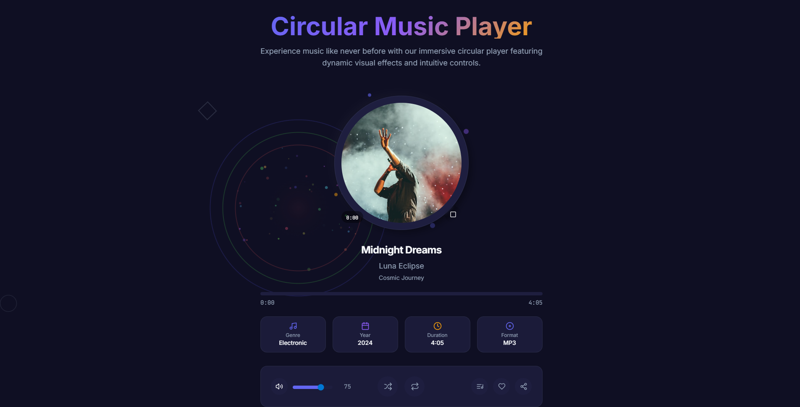

# 🎵 React Music Player  

A modern, responsive **Music Player Web App** built with **React + Vite + Tailwind CSS**.  
It provides audio playback, playlist support, animated visual effects, and a clean interface for an immersive listening experience.  

---

## 🚀 Features
- 🎶 **Play / Pause / Seek** audio tracks  
- 📀 **Album artwork display** with gradient fallback  
- ⏱️ **Progress ring with click-to-seek**  
- 🔊 **Volume control & mute/unmute**  
- 🎧 **Playlist support** (load and navigate songs)  
- 🌈 **Animated circular visualizer** with particle effects  
- 📱 **Responsive UI** powered by Tailwind CSS  
- ⚡ Built with **React 18 + Vite** for speed and hot reload  

---

## 🛠️ Tech Stack
- **Frontend:** React, Vite  
- **Routing:** React Router  
- **Styling:** Tailwind CSS (custom theme colors)  
- **Audio:** Native HTML5 `<audio>` API + React hooks  

---

## 📂 Project Structure
```
src/
 ├── Componants/         # Reusable UI components (buttons, volume control, etc.)
 ├── pages/              # Main interfaces (UserInterface, NotFound)
 ├── styles/             # Tailwind + global CSS
 ├── index.jsx           # Entry point
 └── App.jsx             # Root component
```

---

## 🚦 Getting Started

Clone the repository:
```bash
git clone https://github.com/your-username/react-music-player.git
cd react-music-player
```

Install dependencies:
```bash
npm install
```

Start development server:
```bash
npm run dev
```

Build for production:
```bash
npm run build
```

---

## 📸 Screenshots  

### 🎵 Circular Music Player Interface  


---

## ✨ Future Enhancements
- Playlist management (add/remove songs)  
- Dark/Light mode toggle  
- Lyrics sync support  
- External API integration (Spotify, SoundCloud, YouTube)  

---

## 📜 License
This project is licensed under the MIT License.  
You are free to use, modify, and distribute it for personal or commercial purposes.  

---

👨‍💻 Developed by **SATHISH SUNDHARAMOORTHY**
